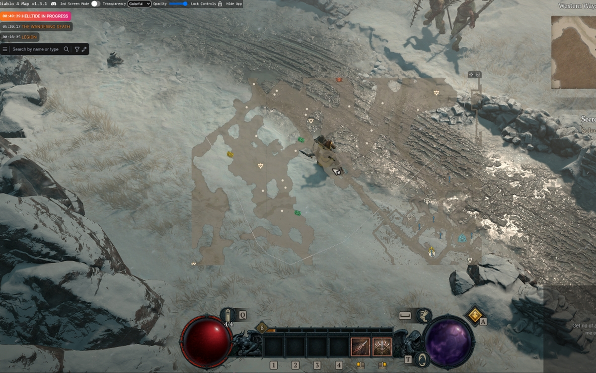
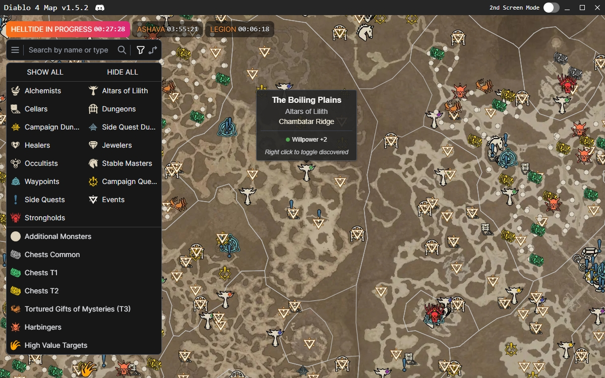
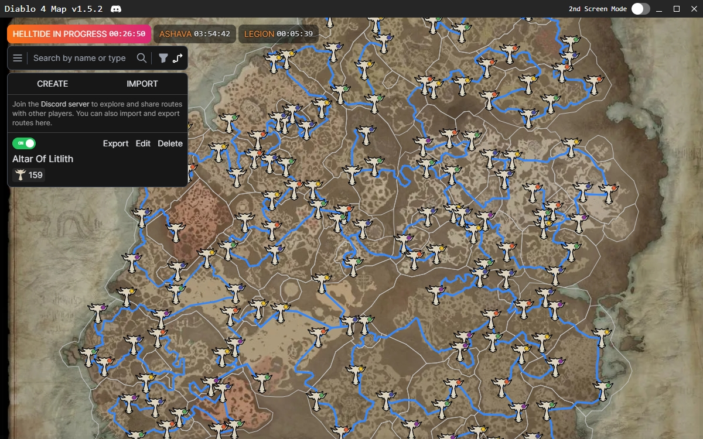

  

<h3 align="center">Diablo 4 Map</h3>

  

    Diablo 4 Interactive Map
     
     
    <a href="https://www.overwolf.com/app/Leon_Machens-Diablo_4_Map">Overwolf</a>
    ·
    <a href="https://diablo4.th.gl/">Web-Version</a>
    ·
    <a href="https://discord.com/invite/NTZu8Px">Discord</a>
  

Available in:  🇫🇷 | 🇺🇸 | 🇷🇺 | 🇩🇪 | 🇪🇸

  
Table of Contents

  <ol>
    <li><a href="#about-the-project">About The Project</a></li>
    <li><a href="#installation">Installation</a></li>
    <li><a href="#features">Features</a></li>
    <li><a href="#contributing">Contributing</a></li>
    <li><a href="#license">License</a></li>
  </ol>

## About The Project

## Installation

Head over to the [Diablo 4 Map](https://www.overwolf.com/app/Leon_Machens-Diablo_4_Map) page on Overwolf and click the "Download" button.

You can also use the web-version of the app [here](https://diablo4.th.gl/).

Join the [Discord](https://discord.com/invite/NTZu8Px) to get the latest news and updates.

## Features

- Realtime player position ([Video](https://youtu.be/kSl2Fm6Fd1w))
- Routes (e.g. All Altars Of Lilith)
- Helltide event timers and zones
- Hundreds of locations like bounty events, side quests or dungeons
- High-resolution map
- Ability to mark nodes as discovered
- Display of region borders
- Filtering of node types
- Node tooltips providing information about the region, type, and requirements
- Search functionality for any nodes
- Overlay mode with hotkey support (no need to use ALT+TAB to access the map)

## Contributing

See the [suggestions-issues](https://discord.com/invite/NTZu8Px) channel on Discord for a full list of proposed features (and known issues).

Contributions are what make the open source community such an amazing place to learn, inspire, and create. Any contributions you make are **greatly appreciated**. 
If you want to contribute to this project, please join the [Discord](https://discord.com/invite/NTZu8Px) and contact me (DevLeon#4001). I will be happy to help you get started.

If you want to contribute directly in this repo, please fork the repo and create a pull request.
Don't forget to give the project a star! Thanks again!

1. Fork the Project
2. Create your Feature Branch (`git checkout -b feature/AmazingFeature`)
3. Commit your Changes (`git commit -m 'Add some AmazingFeature'`)
4. Push to the Branch (`git push origin feature/AmazingFeature`)
5. Open a Pull Request

## License

Distributed under the MIT License. See [`LICENSE`](LICENSE) for more information.
